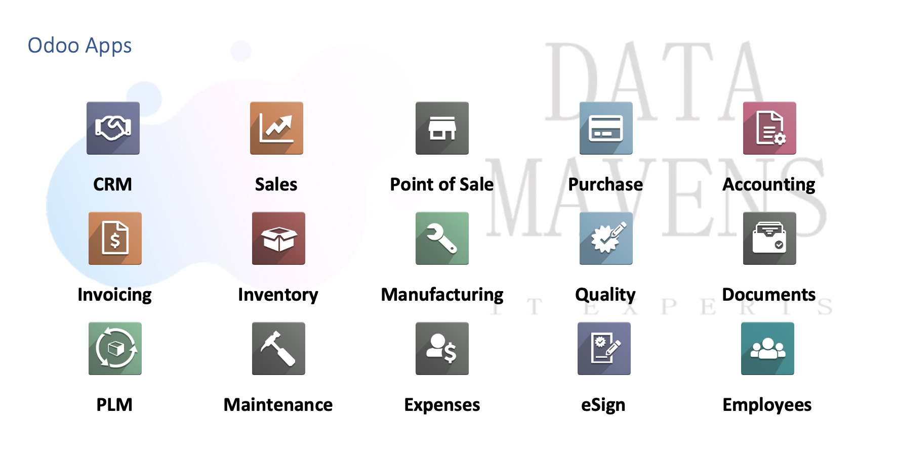

# Nordiq-Hygiene-Care-Industry-Ltd

## Overview
This repository, *data-mavens-io-nordiq-hygiene-care-industry-ltd* embarks on testing and validating the requirements of the client.

## Odoo Apps
* CRM
* Invoicing
* PLM
* Sales
* Inventory
* Maintenance
* Point of Sale
* Manufacturing
* Expenses
* Purchase
* Quality
* eSign
* Accounting
* Documents
* Employees

## Hosting Options – Odoo Online vs Odoo.sh vs Odoo On-Premises
Data Mavens recommends Odoo.sh however this depends on further enquires and establishing all supporting factors from network performance and reliability to any customisations that are required.
Additionally, Odoo.sh comes at an additional cost which is very competitive and durable considering the benefits you receive, the security and reliability of your instance.

## Setup and Configuration Plan

- [x] Install Odoo.sh environment
- [] Install customer selected apps
- [] Load Demo Data
- [] Dry Run
- [] Initial Prod
- [] Activate Staging

## Implementation

### Identified Customer Requirements
